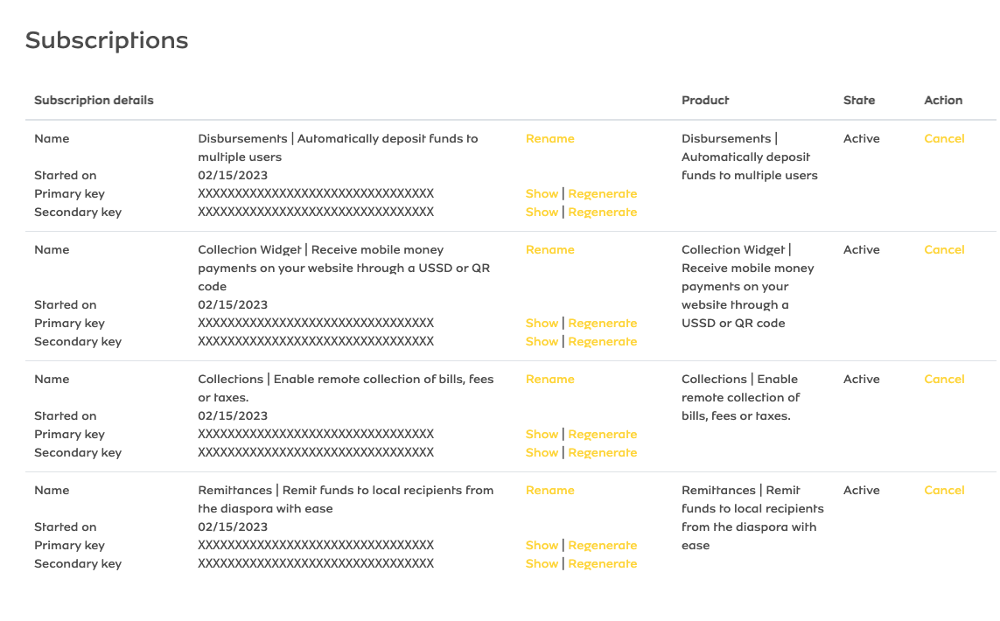

# Getting Started 

## Prerequisites

Before you begin setting up your development environment, ensure that you have the following prerequisites installed:

- **Android Studio Arctic Fox** or later: This is the official Integrated Development Environment (IDE) for Android development, providing all the necessary tools to build, test, and debug Android applications. Make sure to keep it updated to leverage the latest features and improvements.

- **OpenJDK 17**: Ensure that you have OpenJDK 17 installed and configured in Android Studio. This version is required for compiling and running the project. You can download OpenJDK from the [Adoptium](https://adoptium.net/) or [OpenJDK](https://openjdk.java.net/install/) websites.

## Kotlin Style

To maintain consistent code formatting and style across the project, follow these steps to configure Android Studio:

1. **Install and Configure the ktfmt Plugin**:
   - Go to Android Studio's `Settings` (or `Preferences` on macOS).
   - Select the `Plugins` category, click the `Marketplace` tab, search for the `ktfmt` plugin, and click the `Install` button.
   - After installation, navigate to `Editor` → `ktfmt Settings`, tick `Enable ktfmt`, change the `Code style` to `Google (Internal)`, and click `OK`.

2. **Set Indentation to 2 Spaces**:
   - In Android Studio's `Settings` (or `Preferences`), go to `Editor` → `Code Style` → `Kotlin` → `Tabs and Indents`.
   - Set `Tab size`, `Indent`, and `Continuation indent` to `2`, and click `OK`.

3. **Use Single Name Imports Sorted Lexicographically**:
   - In Android Studio's `Settings` (or `Preferences`), go to `Editor` → `Code Style` → `Kotlin` → `Imports`.
   - In the `Top-level Symbols` and `Java statics and Enum Members` sections, select the `Use single name import` option.
   - Remove all rules in the `Packages to Use Imports with '*'` and `Import Layout` sections, then click `OK`.

After completing these steps, you can format your code by going to `Code` → `Reformat Code`, or by pressing `Ctrl+Alt+L` (or `⌘+⌥+L` for Mac). 

**Note**: While these settings help maintain code quality, you can also rely on the Spotless plugin to format any code you want to push. For more details on Spotless, refer to the relevant documentation.

## Build Setup

Follow these steps to set up the project for development:

1. **Clone the Repository**:
   - Begin by cloning this repository to your local machine. Ensure you have **OpenJDK 17** installed and configured in Android Studio to use the OpenJDK 17 JDK for this project. You can clone the repository using the following command:
     ```bash
     git clone https://github.com/re-kast/android-mtn-momo-api-sdk.git
     ```

2. **Update the `local.properties` File**:
   - Provide the required properties for the SDK and Sample App to run by updating the `local.properties` file. Here’s an example configuration:

   :::info
   **Important Note**: Ensure that all entries in the `local.properties` file are filled out correctly. The application will fail to compile if any required entries are missing. Double-check your configuration to avoid compilation errors. For more information on how to find the different keys, read more [here](./engineering/getting-started/developer-setup).
   ```properties
   # Local properties for the MTN MOMO API SDK
   
   MOMO_BASE_URL="" ## Use https://sandbox.momodeveloper.mtn.com for sandbox and https://momodeveloper.mtn.com for production
   MOMO_COLLECTION_PRIMARY_KEY="" ## The collection endpoint/product subscription primary key
   MOMO_COLLECTION_SECONDARY_KEY="" ## The collection endpoint/product subscription secondary key
   MOMO_REMITTANCE_PRIMARY_KEY="" ## The remittance endpoint/product subscription primary key
   MOMO_REMITTANCE_SECONDARY_KEY="" ## The remittance endpoint/product subscription secondary key
   MOMO_DISBURSEMENTS_PRIMARY_KEY="" ## The disbursements endpoint/product subscription primary key
   MOMO_DISBURSEMENTS_SECONDARY_KEY="" ## The disbursements endpoint/product subscription secondary key
   MOMO_API_USER_ID="" ## The sandbox API user ID. You can use a [UUID generator](https://www.uuidgenerator.net/version4) to create one
   MOMO_ENVIRONMENT="" ## API environment, use 'sandbox' for testing and 'production' for live operations
   MOMO_API_VERSION_V1="" ## The API version for v1 endpoints, use 'v1_0' for sandbox and 'v1' for production
   MOMO_API_VERSION_V2="" ## The API version for v2 endpoints, use 'v2_0' for sandbox and 'v2' for production
   ```
   :::

   :::info[Finding the Subscription Details]
   You can find all the subscription keys from the MTN MOMO Developer account. Please sign up by visiting [MTN MOMO Developer](https://momodeveloper.mtn.com/). Once there, navigate to your profile and check the subscriptions section. Below is an image of how the section would look:
   
   :::

3. **Sync the Project**:
   - Sync the project via the Android Studio IDE to download all necessary dependencies. For more information on syncing, read more [here](https://developer.android.com/build/gradle-build-overview).

4. **Run the Sample App**:
   - Once all dependencies are downloaded, you can run the sample app from the Android Studio run menu to test the integration and functionality of the MTN MOMO API SDK.

By following these steps, you will have a fully set up development environment ready for building and testing applications that utilize the MTN MOMO API SDK.

## Application Architecture

The MTN MOMO SDK is based on the **MVVM (Model-View-ViewModel) Android application architecture**. This architecture promotes a clear separation of concerns, making the codebase more manageable and testable. It also follows the recommended [Repository Pattern](https://developer.android.com/jetpack/guide) on its data layer, which helps in abstracting data sources and providing a clean API for data access.

At the core is the Android FHIR SDK, which provides various APIs, including Data Access API, Search API, Sync API, Smart Guidelines API, and Data Capture API.

## Project Structure

The project currently consists of an application module (`sample`) and two Android library modules (`momo-api-sdk`). This modular structure allows for better organization of code and easier maintenance.

## References

- [MTN MOMO Developer Documentation](https://momodeveloper.mtn.com/)
- [Kotlin Official Documentation](https://kotlinlang.org/docs/home.html)
- [Android Studio User Guide](https://developer.android.com/studio/intro)
- [Gradle Build Overview](https://developer.android.com/build/gradle-build-overview)
- [Spotless Plugin Documentation](https://github.com/diffplug/spotless)
- [UUID Generator](https://www.uuidgenerator.net/version4)